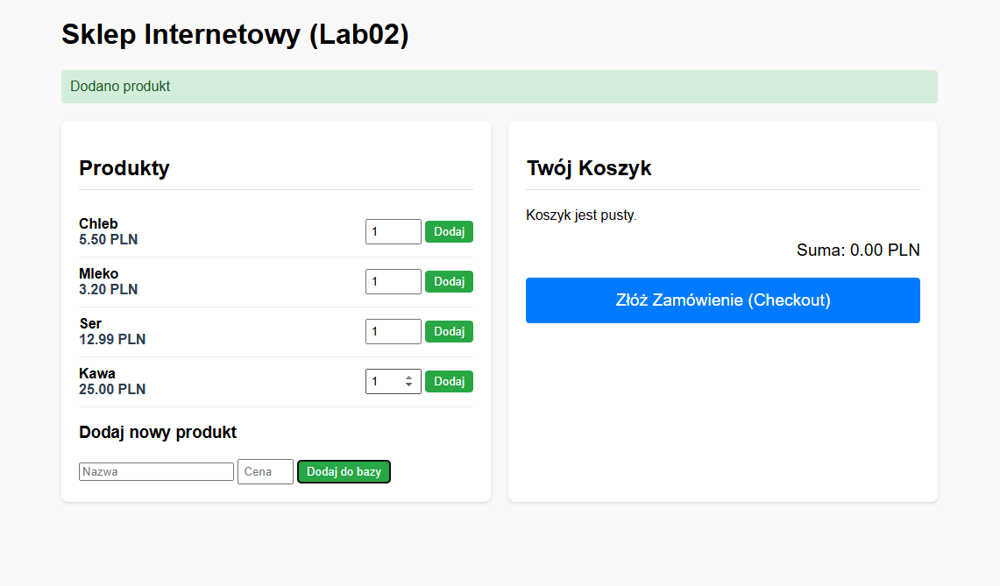
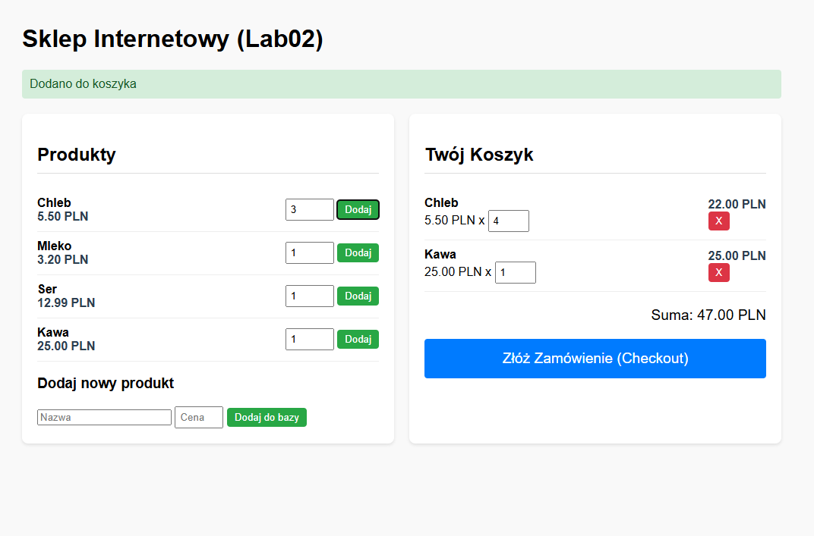

# Lab02 — Sklep: Koszyk i Zamówienia (Shop)

Aplikacja e-commerce napisana w Pythonie (Flask), realizująca funkcjonalności koszyka zakupowego oraz składania zamówień. Projekt zaliczeniowy Lab02.

## Funkcjonalności

* **Produkty:** Pełny CRUD (dodawanie produktów przez formularz), wyświetlanie listy z cenami.
* **Koszyk:** Obsługa koszyka w oparciu o sesję (dodawanie, usuwanie, edycja ilości, dynamiczne sumowanie kosztów).
* **Zamówienia:** Finalizacja zamówienia (Checkout) z zapisem do bazy danych i tzw. "snapshotem" ceny.

## Technologia

* **Backend:** Python 3, Flask, Flask-SQLAlchemy
* **Baza danych:** SQLite (plik `shop.db` tworzony automatycznie przy starcie)
* **Frontend:** HTML5, CSS3, JavaScript (Fetch API)

## Instrukcja uruchomienia

**1. Stwórz środowisko wirtualne:**
```bash
python -m venv venv
```

**2. Aktywuj środowisko:**
* Windows:
  ```bash
  .\venv\Scripts\activate
  ```
* macOS/Linux:
  ```bash
  source venv/bin/activate
  ```

**3. Zainstaluj wymagane biblioteki:**
```bash
pip install -r requirements.txt
```

**4. Uruchom serwer:**
```bash
python app.py
```

**5. Otwórz aplikację:**
Wejdź w przeglądarce na adres: http://127.0.0.1:5000

---

## Zrzuty ekranu

### 1. Dodawanie produktu i widok listy


### 2. Zarządzanie koszykiem


### 3. Finalizacja zamówienia
